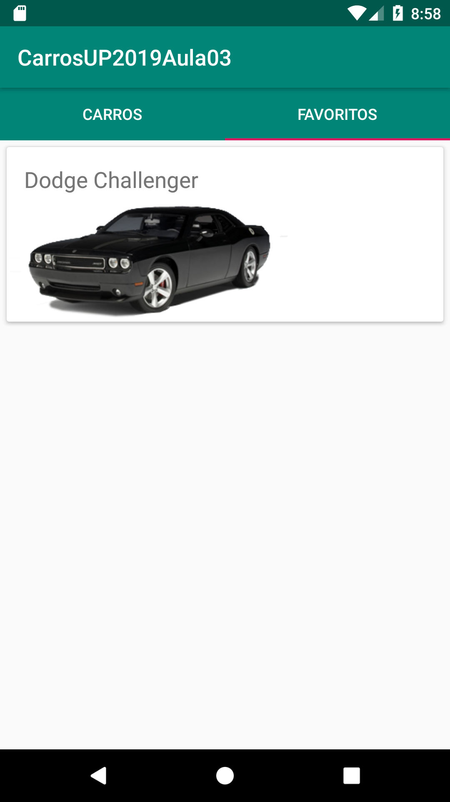

# carros_kotlin_2019_basico_aula03
App simples de lista de carros feitas com Kotlin na aula 3 - android básico

## Projeto utiliza:

* Kotlin
* RecyclerView / CardView
* Room Persistence Library (https://developer.android.com/topic/libraries/architecture/room)

## prints

